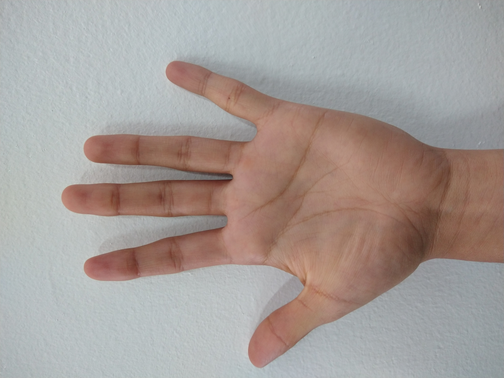

# Assignment 1: Histograms
In this assignment I worked with three images of a hand in three different lighting conditions (indoor, outdoor and shadow)[^book]. 

1. The goal of the assignment is create a RGB histogram of the indoor image (using the `cv2.calcHist` function).
1. Plot the gray-scale histograms of the images using the `matplotlib` library with:

    * 2 bins
    * 16 bins
    * 256 bins 

    Then run a matching routine (using all histogram matching methods) against the other indoor lighting images of hands. 

1. Now add 8 and then 32 bins per dimension and try matching across lighting conditions (train on indoor, test on outdoor).

> __Note__: The development of this assignment was done in the following Jupyter [Notebook](Code.ipynb).

The images used in this assignment are available in the [img folder](Img).

| **Indoor** | **Outdoor** | **Shadow** |
| :--------: | :--------: | :--------: |
|  |  |  |

## References

[^book]: Bradski, G. R., &amp; Kaehler, A. (2011). In Learning opencv: Computer vision with the opencv library (p. 219). essay, O'Reilly. 