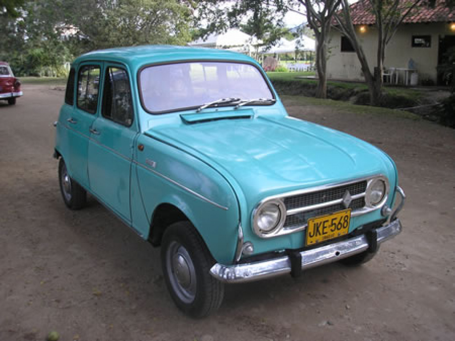

# Assignment 2: Transformations and pre-processing
In this assignment I worked one image of a vehicle plate. The goal was to apply transformations and pre-processing techniques to improve the image quality. The image was taken from internet. The image is shown below. 

1. The first step was to use interpolation to increase the image size[^cambridge].

1. Then, convert the image to different color spaces. The image was converted to HSV, YCbCr, and YIQ color spaces. 

1. Thresholding was applied to the image to improve the contrast.

1. The next step was to apply smoothing filters to the image. The Prewitt filter is a type of edge detection filter which consist of 8 matrices (one for each direction). The filter is applied to the image and the result is shown below.

    

    | $NW$ | $N$ | $NE$ |
    |:----:|:---:|------|
    | $W$ | $-$ | $E$ |
    | $SW$ | $S$ | $SE$ |

    

## References
[^cambridge]: [Cambridge in Colour](https://www.cambridgeincolour.com/tutorials/image-interpolation.htm )